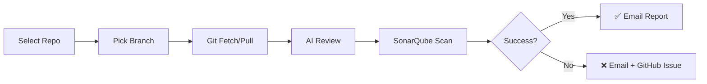

# 🚀 SonarAI v3.0 — AI-Powered Code Quality Agent

**Automate your code quality, security, and performance analysis with AI**

[](https://nodejs.org/)
[](https://dotnet.microsoft.com/)
[](https://www.sonarsource.com/products/sonarqube/)
[](https://www.anthropic.com/)

---

## 🎯 **What is SonarAI?**

SonarAI is an intelligent DevOps agent that automates code quality analysis by combining:
- 🤖 **Claude AI** for intelligent code review
- 🔍 **SonarQube** for static code analysis
- 📧 **Email notifications** with professional reports
- 🐙 **GitHub integration** for automatic issue tracking

**Perfect for:** Development teams, DevOps engineers, security analysts

---

## ✨ **Features**

### 🎨 **Beautiful Dashboard**
- Real-time repository browsing
- Branch selection with commit history
- Live operation logs with terminal UI
- Visual quality metrics and ratings

### 🤖 **AI Code Review (Claude)**
- Security vulnerability detection
- Performance bottleneck analysis
- Code maintainability scoring
- Actionable recommendations

### 🔍 **SonarQube Integration**
- Automated 3-step scan process
- Bugs, vulnerabilities, code smells tracking
- Quality gate enforcement
- Coverage reporting

### 📧 **Professional Email Reports**
- HTML-formatted notifications
- Visual metrics and charts
- Success/failure alerts
- Automatic GitHub issue linking

### 🔒 **Security First**
- Input validation and sanitization
- Path traversal protection
- Token masking in logs
- Rate limiting (10 req/min)
- CORS and CSP headers

---

## 📋 **Quick Start**

### **Prerequisites**
- ✅ Node.js 18+
- ✅ .NET SDK 6.0+
- ✅ Git
- ✅ SonarQube (local or remote)
- ✅ GitHub Account
- ✅ Claude API Key
- ✅ Gmail Account (for email)

### **Installation**

```bash
# 1. Clone repository
git clone https://github.com/sachinnishad98/sonarqube-ai-agent-v1.git
cd sonarqube-ai-agent-v1

# 2. Install dependencies
npm install

# 3. Install SonarScanner
dotnet tool install --global dotnet-sonarscanner

# 4. Configure .env (see below)
cp .env.example .env
# Edit .env with your credentials

# 5. Verify setup
node test-setup.js

# 6. Start agent
npm start
```

### **Configuration (.env)**

```env
# GitHub
GITHUB_USERNAME=your_username
GITHUB_TOKEN=ghp_xxxxxxxxxxxxx

# SonarQube (local)
SONAR_URL=http://localhost:9000
SONAR_TOKEN=sqa_xxxxxxxxxxxxx

# Claude AI
ANTHROPIC_API_KEY=sk-ant-xxxxxxxxxxxxx

# Email (Gmail)
SMTP_HOST=smtp.gmail.com
SMTP_PORT=587
SMTP_USER=your_email@gmail.com
SMTP_PASS=your_app_password
NOTIFY_EMAIL=your_email@gmail.com

# Paths
REPO_PATH=D:\SonarQube\SonarQube-AI-Agent
```

📘 **[Complete Setup Guide](SETUP_GUIDE.md)** — Detailed instructions with screenshots

---

## 🔄 **Workflow**



### **Step-by-Step:**

1. **Open Dashboard:** `http://localhost:3002`
2. **Select Repository:** Browse your GitHub repos
3. **Pick Branch:** Choose branch to analyze
4. **Git Operations:** Fetch + checkout + pull
5. **AI Review:** Claude analyzes code (30s)
6. **Sonar Scan:** 3-step quality scan (2-5 min)
7. **Results:** Dashboard + Email + SonarQube report

---

## 📊 **Architecture**

```
┌─────────────────┐
│   Dashboard     │  ← Browser UI (Tailwind CSS)
│   (WebSocket)   │
└────────┬────────┘
         │ Socket.IO (real-time)
         ↓
┌─────────────────┐
│   Node.js       │
│   Express       │  ← Backend Server
│   Socket.IO     │
└────────┬────────┘
         │
    ┌────┴────┬────────┬──────────┬─────────┐
    ↓         ↓        ↓          ↓         ↓
┌────────┐ ┌────┐ ┌────────┐ ┌──────┐ ┌────────┐
│ GitHub │ │Git │ │Claude  │ │Sonar │ │ Email  │
│  API   │ │CMD │ │AI API  │ │Qube  │ │ SMTP   │
└────────┘ └────┘ └────────┘ └──────┘ └────────┘
```

---

## 🖼️ **Screenshots**

### **Dashboard Overview**


### **AI Review Results**


### **SonarQube Scan**


---

## 🔒 **Security Features**

| Feature | Implementation |
|---------|---------------|
| **Input Validation** | Regex-based repo/branch name checks |
| **Path Traversal** | Blocked via path resolution checks |
| **Token Masking** | Secrets hidden in error logs |
| **Rate Limiting** | 10 requests/min per socket |
| **CORS** | Localhost-only access |
| **CSP** | Strict Content Security Policy |
| **Secure Git** | `execFile()` with timeout + buffer limits |

---

## 🤖 **AI-Powered Analysis**

### **What Claude AI Reviews:**

✅ **Security:**
- SQL injection vulnerabilities
- Hardcoded secrets/credentials
- XSS risks
- OWASP Top 10 issues

✅ **Performance:**
- N+1 queries
- Memory leaks
- Inefficient algorithms
- Database connection handling

✅ **Maintainability:**
- Code complexity
- Duplicate code
- Naming conventions
- Documentation quality

---

## 📧 **Email Notifications**

### **Success Email:**
- Quality metrics (bugs, vulnerabilities, code smells)
- Ratings (A-E) for reliability, security, maintainability
- Code coverage chart
- Link to SonarQube dashboard

### **Failure Email:**
- Error details with stack trace
- Recommended actions
- Auto-created GitHub issue link

---

## 🚀 **For Organizations**

Ready to deploy in your enterprise? Here's what to change:

### **1. Azure DevOps Integration**
Replace GitHub API calls with Azure DevOps REST API

### **2. Remote SonarQube**
Update `SONAR_URL` to your enterprise server

### **3. LDAP/SSO Authentication**
Add auth middleware for dashboard access

### **4. Database Storage**
Store scan history in PostgreSQL/MongoDB

### **5. CI/CD Integration**
Add GitHub Actions or Azure Pipelines triggers

📘 **[Organization Deployment Guide](docs/ENTERPRISE.md)** (Coming soon)

---

## 📁 **Project Structure**

```
sonarqube-ai-agent-v1/
├── server.js              # Backend (Express + Socket.IO)
├── public/
│   └── index.html         # Dashboard UI
├── .env                   # Configuration (SECRET!)
├── .env.example           # Template
├── package.json           # Dependencies
├── test-setup.js          # Setup verification
├── SETUP_GUIDE.md         # Detailed setup
└── README.md              # This file
```

---

## 🐛 **Troubleshooting**

### **"SonarQube unreachable"**
```bash
# Start SonarQube
cd <sonarqube>/bin/windows-x86-64
.\StartSonar.bat

# Wait 2-3 minutes, then verify:
curl http://localhost:9000/api/system/status
```

### **"Git operations timeout"**
- Check internet connection
- Verify GitHub token: https://github.com/settings/tokens
- Ensure repo path exists

### **"Email not sending"**
- Use Gmail App Password (not regular password)
- Enable 2-Step Verification first
- Test SMTP: https://nodemailer.com/smtp/testing/

### **"AI review fails"**
- Verify API key: https://console.anthropic.com/settings/keys
- Check rate limits (free tier: 50 req/min)

Run full diagnostics:
```bash
node test-setup.js
```

---

## 📈 **Roadmap**

- [ ] Multi-language support (Python, Java, Go)
- [ ] Historical trend analysis
- [ ] Slack/Teams integration
- [ ] Custom quality rules
- [ ] PR comment integration
- [ ] Docker deployment
- [ ] Kubernetes support

---

## 🤝 **Contributing**

Contributions welcome! Please:
1. Fork the repo
2. Create feature branch (`git checkout -b feature/amazing`)
3. Commit changes (`git commit -m 'Add amazing feature'`)
4. Push to branch (`git push origin feature/amazing`)
5. Open Pull Request

---

## 📄 **License**

MIT License — see [LICENSE](LICENSE) file

---

## 👨‍💻 **Author**

**Sachin Nishad**  
📧 sachinnishad834@gmail.com  
🐙 [@sachinnishad98](https://github.com/sachinnishad98)

---

## 🙏 **Acknowledgments**

- **Anthropic** — Claude AI API
- **SonarSource** — SonarQube
- **GitHub** — Repository hosting
- **Tailwind CSS** — Beautiful UI components

---

<div align="center">

**Built with ❤️ for better code quality**

[Report Bug](https://github.com/sachinnishad98/sonarqube-ai-agent-v1/issues) • [Request Feature](https://github.com/sachinnishad98/sonarqube-ai-agent-v1/issues) • [View Demo](http://localhost:3002)

</div>
